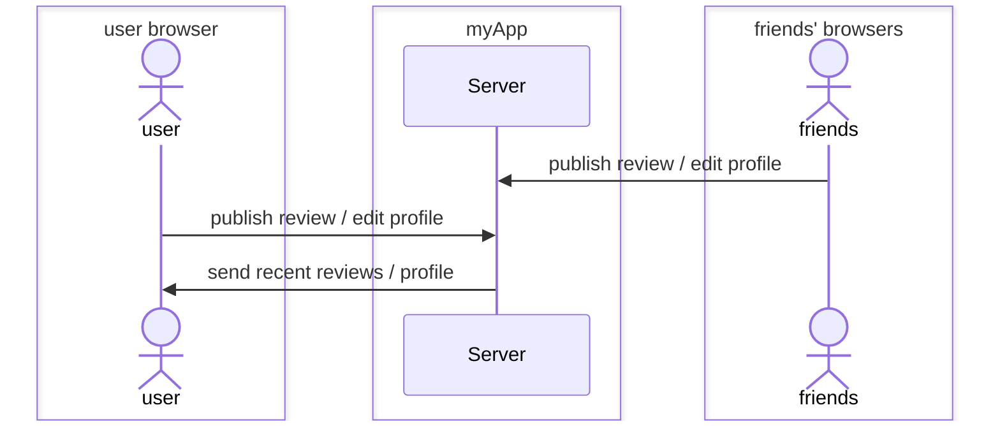

# **_[Logline](https://startup.logline.click/)_** -- My cs260 Startup

[My class notes](notes.md)

**_Logline_** is a web app that allows users to log, share, and read short 1-2 line film reviews. Users can read through the newest reviews as well as look back on their own previous reviews or their friend's.

## 🚀 Specification Deliverable

For this deliverable I did the following. I checked the box `[x]` and added a description for things I completed.

- [x] Proper use of Markdown
- [x] A concise and compelling elevator pitch
- [x] Description of key features
- [x] Description of how you will use each technology
- [x] One or more rough sketches of your application. Images must be embedded in this file using Markdown image references.

### Elevator pitch

Would you like to share your enthusiasm for a particular movie with your friends? Want to know that people are saying about the latest blockbuster? The _Logline_ application allows you to read and publish short reviews on new and classic films.

### Design

The startup has 5 pages:

1. Register/Login - regiser/login page. includes a random movie quote under startup logo
2. Reviews - this is where the latest reviews are listed
3. ViewProfile - this is where a user can view their own profile (from nav bar) or another user's profile (linked from a review)
4. EditProfile - this is where a user can edit their own profile -- add a bio, name (maybe allow to change username?)
5. PublishReview - this is where a user can create a new review

#### Design pages sketches

1. Register/Login  
   

2. Reviews  
   

3. ViewProfile  
   

4. EditProfile  
   

5. PublishReview  
   

#### Design sequence diagram

Here is a simple sequence diagram showing how a user interacts with my server to publish changes as well as view their and their friends' profiles/reviews:

### Key features

- User can publish their own movie review
- User can view page of latest reviews
- User can view user profiles and edit their own
- User can see log of previous their own reviews
- Ability to like a review

### Technologies

I am going to use the required technologies in the following ways.

- **HTML** - Uses correct HTML structure for application. Hyperlinks to navigate pages.
- **CSS** - Application styling that looks good on different screen sizes, and uses good whitespace, coloring choices, and contrast.
- **React** - Description here
- **Service**
  - Backend service with endpoints for:
    - login
    - retrieving reviews/profiles
    - submitting new reviews
    - editing user profile
  - Third party service for getting random movie quote
- **DB/Login** - DB stores user profiles, reviews. Registering user adds them to DB which securely stores login credentials. User's can't publish review unless authenticated.
- **WebSocket** - User receives an alert when one of their reviews gets a like.

## 🚀 AWS deliverable

For this deliverable I did the following. I checked the box `[x]` and added a description for things I completed.

- [x] **Server deployed and accessible with custom domain name** - [https://logline.click](https://logline.click).

## 🚀 HTML deliverable

For this deliverable I did the following. I checked the box `[x]` and added a description for things I completed.

- [x] **HTML pages** - index.html for login/register, publishReview.html to publish a new review, reviews.html to read reviews, viewProfile.html to view reviewers profile (including the user's own profile), editProfile.html to edit the user's own profile
- [x] **Proper HTML element usage** - I did not complete this part of the deliverable.
- [x] **Links** - Nav links between each page. Username of review links to view profile.
- [x] **Text** - I did not complete this part of the deliverable.
- [x] **3rd party API placeholder** - placeholder on index.html for movie quote API
- [x] **Images** - FilmStrip image on index.html page and icon on each page.
- [x] **Login placeholder** - Login/Register placeholder on index.html
- [x] **DB data placeholder** - review data and profile data will be stored in DB.
- [x] **WebSocket placeholder** - place holder in reviews.html for likes to update live and/or user to be notified when their review receives a like

## 🚀 CSS deliverable

For this deliverable I did the following. I checked the box `[x]` and added a description for things I completed.

- [x] **Header, footer, and main content body** - CSS for header footer and main is implemented main.css
- [x] **Navigation elements** - navbar with navlinks - active page is highlighted
- [x] **Responsive to window resizing** - used a lot of flex and some display changes on media (see main.css)
- [x] **Application elements** - includes elements for application
- [x] **Application text content** - includes application mock text
- [x] **Application images** - includes images

## 🚀 React part 1: Routing deliverable

For this deliverable I did the following. I checked the box `[x]` and added a description for things I completed.

- [x] **Bundled using Vite** - installed vite using npm and setup project directory with src and public folders
- [x] **Components** - created a app with a header and footer with a router to components for login, reviews. etc
- [x] **Router** - Routing between login and browse reviews, profile, etc. components.

## 🚀 React part 2: Reactivity

For this deliverable I did the following. I checked the box `[x]` and added a description for things I completed.

- [x] **All functionality implemented or mocked out** - Everything works locally except for user getting like notifications are mocked out (to implement with web socket). Service calls mocked out to use localStorage data but works for multiple users locally. Since everything is saved to local storage multiple users can login (at separate times of course) and view/edit/like reviews/profiles.

Only the login and browse reviews pages are available to all users (however unauthorized users cannot like reviews). Everything else must be accessed by an authorized user.

- [x] **Hooks** - Used hooks to render reviews, forms, profiles

## 🚀 Service deliverable

For this deliverable I did the following. I checked the box `[x]` and added a description for things I completed.

- [x] **Node.js/Express HTTP service** - Use Express to handle HTTP requests on application backend
- [x] **Static middleware for frontend** - serve front end via public folder
- [x] **Calls to third party endpoints** - Login.jsx calls a movie database to get a poster url (searches by movie title)
- [x] **Backend service endpoints** - Added and tested endpoints through curl. backends for auth, profile, reviews, likes, and some movie quotes
- [x] **Frontend calls service endpoints** - front end calls backend

## 🚀 DB/Login deliverable

For this deliverable I did the following. I checked the box `[x]` and added a description for things I completed.

- [x] **User registration** - registration creates a new user and returns an authtoken.
- [x] **User login and logout** - login/logout updates/removes authtoken (only 1 authtoken per user).
- [x] **Stores data in MongoDB** - DB stores reviews (including review likes), profiles, and users
- [x] **Stores credentials in MongoDB** - User name and password are stored in user collection in DB. Password is encrypted by back end service before it is stored in DB.
- [x] **Restricts functionality based on authentication** - back end services require auth

## 🚀 WebSocket deliverable

For this deliverable I did the following. I checked the box `[x]` and added a description for things I completed.

- [ ] **Backend listens for WebSocket connection** - I did not complete this part of the deliverable.
- [ ] **Frontend makes WebSocket connection** - I did not complete this part of the deliverable.
- [ ] **Data sent over WebSocket connection** - I did not complete this part of the deliverable.
- [ ] **WebSocket data displayed** - I did not complete this part of the deliverable.
- [ ] **Application is fully functional** - I did not complete this part of the deliverable.
