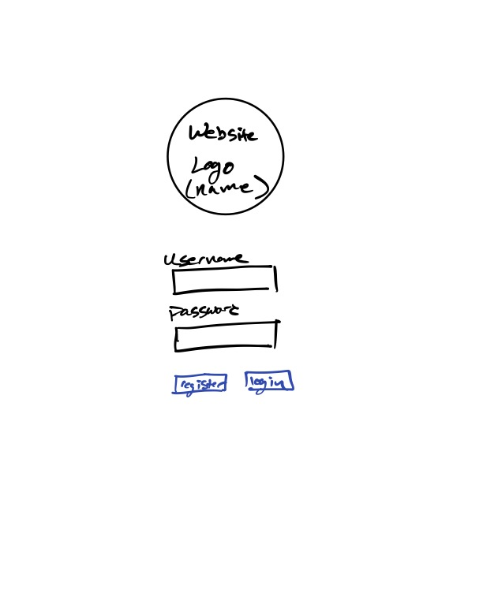
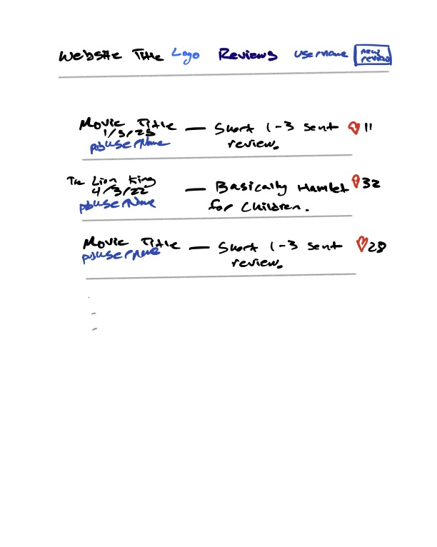
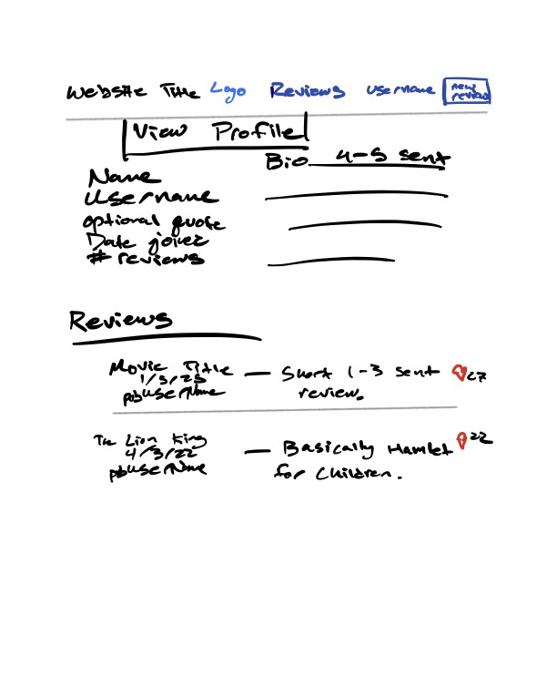
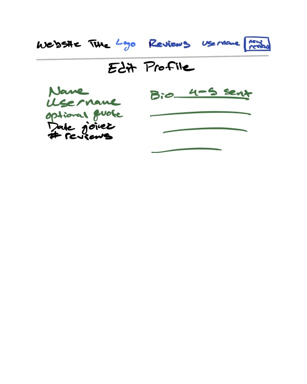
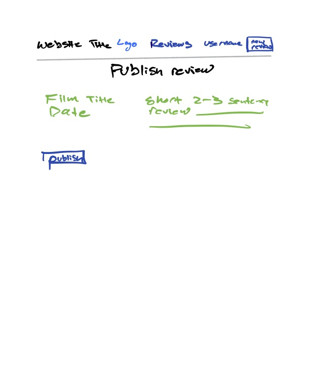
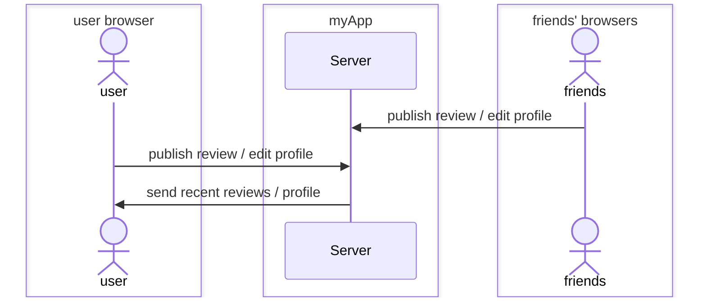

# ***[Logline](https://startup.logline.click/)*** -- My cs260 Startup

[My class notes](notes.md)

***Logline*** is a web app that allows users to log, share, and read short 1-2 line film reviews. Users can read through the newest reviews as well as look back on their own previous reviews or their friend's.

## 🚀 Specification Deliverable

For this deliverable I did the following. I checked the box `[x]` and added a description for things I completed.

- [x] Proper use of Markdown
- [x] A concise and compelling elevator pitch
- [x] Description of key features
- [x] Description of how you will use each technology
- [x] One or more rough sketches of your application. Images must be embedded in this file using Markdown image references.

### Elevator pitch
Would you like to share your enthusiasm for a particular movie with your friends? Want to know that people are saying about the latest blockbuster? The *Logline* application allows you to read and publish short reviews on new and classic films. 

### Design
The startup has 5 pages:
1. Register/Login - regiser/login page. includes a random movie quote under startup logo
2. Reviews - this is where the latest reviews are listed
3. ViewProfile - this is where a user can view their own profile (from nav bar) or another user's profile (linked from a review)
4. EditProfile - this is where a user can edit their own profile -- add a bio, name (maybe allow to change username?) 
5. PublishReview - this is where a user can create a new review

#### Design pages sketches
1. Register/Login  

2. Reviews  

3. ViewProfile  

4. EditProfile   

5. PublishReview   

#### Design sequence diagram
Here is a simple sequence diagram showing how a user interacts with my server to publish changes as well as view their and their friends' profiles/reviews:

### Key features

- User can publish their own movie review
- User can view page of latest reviews
- User can view user profiles and edit their own
- User can see log of previous their own reviews
- Ability to like a review

### Technologies

I am going to use the required technologies in the following ways.

- **HTML** - Uses correct HTML structure for application. Hyperlinks to navigate pages.
- **CSS** - Application styling that looks good on different screen sizes, and uses good whitespace, coloring choices, and contrast.
- **React** - Description here
- **Service**
    - Backend service with endpoints for:
        - login
        - retrieving reviews/profiles
        - submitting new reviews
        - editing user profile
    - Third party service for getting random movie quote
- **DB/Login** - DB stores user profiles, reviews. Registering user adds them to DB which securely stores login credentials. User's can't publish review unless authenticated.
- **WebSocket** - User receives an alert when one of their reviews gets a like.

## 🚀 AWS deliverable

For this deliverable I did the following. I checked the box `[x]` and added a description for things I completed.

- [x] **Server deployed and accessible with custom domain name** - [https://logline.click](https://logline.click).

## 🚀 HTML deliverable

For this deliverable I did the following. I checked the box `[x]` and added a description for things I completed.

- [ ] **HTML pages** - I did not complete this part of the deliverable.
- [ ] **Proper HTML element usage** - I did not complete this part of the deliverable.
- [ ] **Links** - I did not complete this part of the deliverable.
- [ ] **Text** - I did not complete this part of the deliverable.
- [ ] **3rd party API placeholder** - I did not complete this part of the deliverable.
- [ ] **Images** - I did not complete this part of the deliverable.
- [ ] **Login placeholder** - I did not complete this part of the deliverable.
- [ ] **DB data placeholder** - I did not complete this part of the deliverable.
- [ ] **WebSocket placeholder** - I did not complete this part of the deliverable.

## 🚀 CSS deliverable

For this deliverable I did the following. I checked the box `[x]` and added a description for things I completed.

- [ ] **Header, footer, and main content body** - I did not complete this part of the deliverable.
- [ ] **Navigation elements** - I did not complete this part of the deliverable.
- [ ] **Responsive to window resizing** - I did not complete this part of the deliverable.
- [ ] **Application elements** - I did not complete this part of the deliverable.
- [ ] **Application text content** - I did not complete this part of the deliverable.
- [ ] **Application images** - I did not complete this part of the deliverable.

## 🚀 React part 1: Routing deliverable

For this deliverable I did the following. I checked the box `[x]` and added a description for things I completed.

- [ ] **Bundled using Vite** - I did not complete this part of the deliverable.
- [ ] **Components** - I did not complete this part of the deliverable.
- [ ] **Router** - Routing between login and voting components.

## 🚀 React part 2: Reactivity

For this deliverable I did the following. I checked the box `[x]` and added a description for things I completed.

- [ ] **All functionality implemented or mocked out** - I did not complete this part of the deliverable.
- [ ] **Hooks** - I did not complete this part of the deliverable.

## 🚀 Service deliverable

For this deliverable I did the following. I checked the box `[x]` and added a description for things I completed.

- [ ] **Node.js/Express HTTP service** - I did not complete this part of the deliverable.
- [ ] **Static middleware for frontend** - I did not complete this part of the deliverable.
- [ ] **Calls to third party endpoints** - I did not complete this part of the deliverable.
- [ ] **Backend service endpoints** - I did not complete this part of the deliverable.
- [ ] **Frontend calls service endpoints** - I did not complete this part of the deliverable.

## 🚀 DB/Login deliverable

For this deliverable I did the following. I checked the box `[x]` and added a description for things I completed.

- [ ] **User registration** - I did not complete this part of the deliverable.
- [ ] **User login and logout** - I did not complete this part of the deliverable.
- [ ] **Stores data in MongoDB** - I did not complete this part of the deliverable.
- [ ] **Stores credentials in MongoDB** - I did not complete this part of the deliverable.
- [ ] **Restricts functionality based on authentication** - I did not complete this part of the deliverable.

## 🚀 WebSocket deliverable

For this deliverable I did the following. I checked the box `[x]` and added a description for things I completed.

- [ ] **Backend listens for WebSocket connection** - I did not complete this part of the deliverable.
- [ ] **Frontend makes WebSocket connection** - I did not complete this part of the deliverable.
- [ ] **Data sent over WebSocket connection** - I did not complete this part of the deliverable.
- [ ] **WebSocket data displayed** - I did not complete this part of the deliverable.
- [ ] **Application is fully functional** - I did not complete this part of the deliverable.
